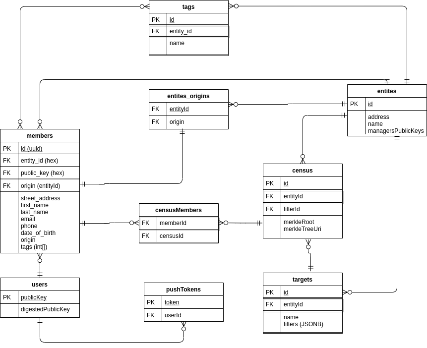

# Vocdoni Manager Backend

The manager is a private service providing organizations with a UI to manage their community and edit their public content. This involved news feeds, voting processes, assemblies, events, etc.

It also allows to manage the members and their attributes (for example, age or payment status). Such data typically lives on a private database that will compute updated snapshots of the census at a given point in time.

The manager also allows to define the requirements that users have to accomplish for a user to be in a census and export the generated censuses.

<div style="padding: 20px; background-color: white; text-align: center;">
        
</div>

The manager is made of three components which can be executed separately or together:

- Centralized Backend
   - Database
   - APIs
       - [Manager API](/manager/README.md)
       - [Registry API](/registry/README.md)
       - [Token API](tokenapi/README.md)
- Push Notification service
   - [Push Notifications API](/notify/README.md)

## Centralized Backend (dvotemanager)

### Database


#### Design
A relational database is being used to store the necessary information. The following schema describes the involved relational entities:



The main entities are:
- `User`: a unique identity, defined by a public key (currently ECDSA), representing a physical person
- `Entity`: An organization identified by its entityID (generated by its ECDSA key)
- `Member`: A member of an **Entity**. A member becomes associated with a user when the corresponding public key is provided. As UID of the member a UUID is used, referenced also later as member **token**.
- `Tags`: Word tags defined by the organization admin, that allow segmenting the members' list 
- `Targets`: The targets are collection of filters that, similarly to tags allow to segment the members'list.
- `Census`: A census, as created and publishedp by go-dvote gateways, is a MerkleTree that contains the publick keys (hashed) of the members who participate in the census.

#### Implementation
The database is designed as a relational DB, and is implemented in Postgres. Nevertheless, the DB calls are abastracted by an the interface `database/database.go`, allowing for other implementations as well.

For the performing the with Postgres queries we use [jmoiron/sqlx](github.com/jmoiron/sqlx), which uses the [lib/pq](github.com/lib/pq) module for connection.

Database migrations ara handled with the [rubenv/sql-migrate](github.com/rubenv/sql-migrate) module.


### APIs

#### API Service

The API service, called `EndPoint` in the codebase, contains the logic and components for orchestrating and managing the entity manager API.

The API service wraps:
- `router`: Manages the incoming requests
- `proxy`: Contains the underlying logic of the API (transports, requests and responses internal handling, TLS)
- `metrics agent`: Graphana and Prometheus metrics system

The types of the following APIs can found in `types/api.go`

##### Router

Is in charge of handling the available API endpoints as well as the authentication and message handling.
Some methods exposed are private and only will be handled sucessfully with the proper signature based authentication check.

Each router contains an **ECDSA** key-pair based on **secp256k1** elliptic curve used for authenticating each response univocally.

On every raw request received the router will decode the raw bytes and will do the proper message checks including those mentioned
before, then the valid decoded request is returned to be handled by a higher level code abstraction containing each specified method logic.

Once each request is processed the router will be used again to encode the successfully processed response or the error received from the
request execution.

##### Proxy

Contains the HTTP server of the API itself, the low level middleware and the TLS certificates management.
It is able to handle relatively big amounts of websockets and HTTP requests with or without TLS.

#### Metrics agent

Enables usefull and fashion view of the API service overall status.


#### Manager API
The  Manager API allows organizations to perform all the necessary management actions on the backend that are related to their members and the corresponding censuses. This invloves:
- Registering new `Entities` and managing their info
- Managing `Members` and their information. Related to `Member` management also some `Token` calls are provided
- Creating and managing `Tags` for these members
- Creating and managing `Targets` that combine member attributes and tags in order to provide the ability to segment the members
- Creating and managing `Censuses` based that eacho of them is related with one concrete `Target` 

Available by default under `/manager`.
A detailed version of the API can be found [here](/manager/README.md).

#### Registry API
The Registry API allows organizations to register new users into its database, the registration can be done by a generated token (the user can exists or not) or by just adding the user directly without any token validation. It also allows to fetch the current registration status of each user.

Available by default under `/registry`
A detailed version of the API can be found [here](/registry/README.md).


#### Token API 
The Token API allows organizations to take control over the user tokens required for user registration on the Vocdoni registry backend.


Available by default under `/token`.
A detailed version of the API can be found [here](/tokenapi/README.md).


### Run

**Config file example (dvotemanager.yaml)**
```yaml
api:
  datadir: /home/user/.dvotemanager
  listenhost: 127.0.0.1
  listenport: 9000
  logerrorfile: ""
  saveconfig: false
  ssl:
    dircert: /home/user/.dvotemanager/tls
    domain: ""
    signingkey: 0eb3e3d8c699ee5c9e8728f9d343d9fa61d1a8528e727958d40ca1d4dcb326f1
datadir: /home/user/.dvotemanager
db:
  dbname: vocdonimgr
  password: vocdoni
  host: 127.0.0.1
  port: 5432
  sslmode: disable
  user: vocdoni
logerrorfile: ""
loglevel: debug
logoutput: stdout
saveconfig: false
signingkey: c6446f24d08a34fdefc2501d6177b25e8a1d0f589b7a06f5a0131e9a8d0307e4
smtp:
  host: "smtp.host.org"
  user: "user@smtp.host.org"
  password: "password"
  poolsize: 4
  validationUrl: https://vocdoni.link/validation
  sender: "user@smtp.host.org"
  senderName: "Vocdoni"
```

Using the above config (or passing the arguments through command line) the dvotemanager can be executed as:

```bash
go build cmd/dvotemanager/dvotemanager.go
go run cmd/dvotemanager/dvotemanager.go --dataDir="/home/user/.dvotemanager"
```

In order to execute a single API, for example the Registry API, the mode flag is used (default value `"all"`):

```bash
go run cmd/dvotemanager/dvotemanager.go --dataDir="/home/user/.dvotemanager --mode="registry"
```

More options and their exaplantion can be found by executing:

```bash
go run cmd/dvotemanager/dvotemanager.go --help
```

#### Running with docker

Running dvotemanager together with a Postgres container and the Vocdoni `manager-frontend`
```bash
$ cd misc/compose
$ docker-compose build
# Start postgres, dvotemanager and a testing frontend:
$ docker-compose up
```

Alternatively. You can start only postgres and the frontend and then execute manually the dvotemanager:

```bash
$ docker-compose up -d postgres
$ docker-compose up -d webmanager
$ go run cmd/dvotemanager/dvotemanager.go --dbSslmode="disable" --dbUser="vocdoni" --dbPassword="vocdoni" --dbName="vocdonimgr"
# OR
# go run cmd/dvotemanager/dvotemanager.go --dataDir="/home/user/.dvotemanager"
```

To stop and delete the database execute:

```bash
$ docker-compose down -v
```

#### Connect dvotemanager

```bash
$ go run cmd/dvotemanager/dvotemanager.go --dbSslmode="disable" --dbUser="vocdoni" --dbPassword="vocdoni" --dbName="vocdonimgr"
```

#### Tests

```bash
$ go test ./...
```
<p>&nbsp;</p>

## Notifications service

The notifications service is a service that tracks the metadata of the entities stored in an entity manager database, it also tracks each entity
process creation (via EVM compatible chain). Both trackings are used to send push notifications according to a logic with the data tracked.

The notification service needs:

- To be connected to the manager backend.
- To be connected to an external web3 provider.
- To have an IPFS node to conecto to.

**Config file example**

```yaml
datadir: /home/user/.dvotenotif
db:
  dbname: vocdoni
  host: 127.0.0.1
  password: vocdoni
  port: 5432
  sslmode: prefer
  user: vocdoni
ethereum:
  bootnodes: '[]'
  chaintype: sokol
  datadir: /home/user/.dvotenotif/ethereum
  lightmode: false
  nodeport: 30303
  nowaitsync: true
  processdomain: voting-process.vocdoni.eth
  signingkey: 0x0
  trustedpeers: '[]'
ethereumevents:
  censussync: true
  subscribeonly: true
ipfs:
  configpath: /home/user/.dvotenotif/ipfs
  noinit: false
  synckey: ""
  syncpeers: '[]'
logerrorfile: ""
loglevel: debug
logoutput: stdout
metrics:
  enabled: true
  refreshinterval: 10
migrate:
  action: ""
notifications:
  keyfile: /home/user/.dvotemanager/key
  service: 1
web3:
  enabled: true
  route: /web3
  rpchost: 127.0.0.1
  rpcport: 9091
  w3external: ws://sokol.poa.network:8546
```

#### Run

```bash
go run cmd/dvotenotif/dvotenotif.go --pushNotificationsKeyFile priv_file --ethSigningKey 0x0 --w3External ws://sokol.poa.network:8546 --ethChain sokol --logLevel debug
```